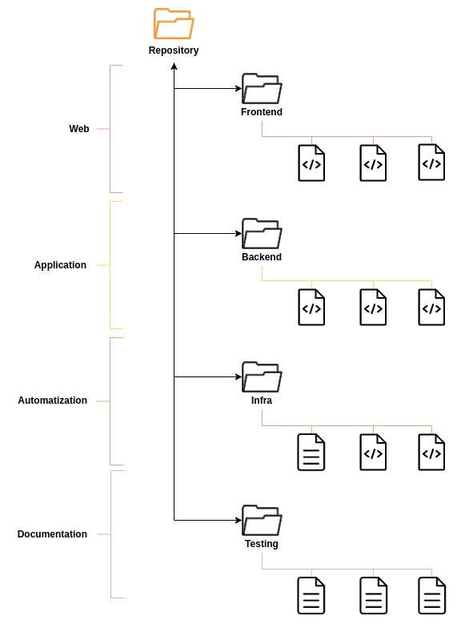
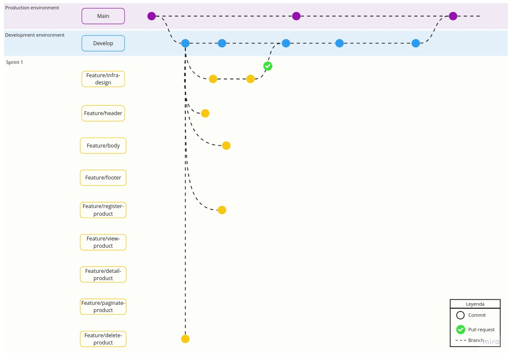
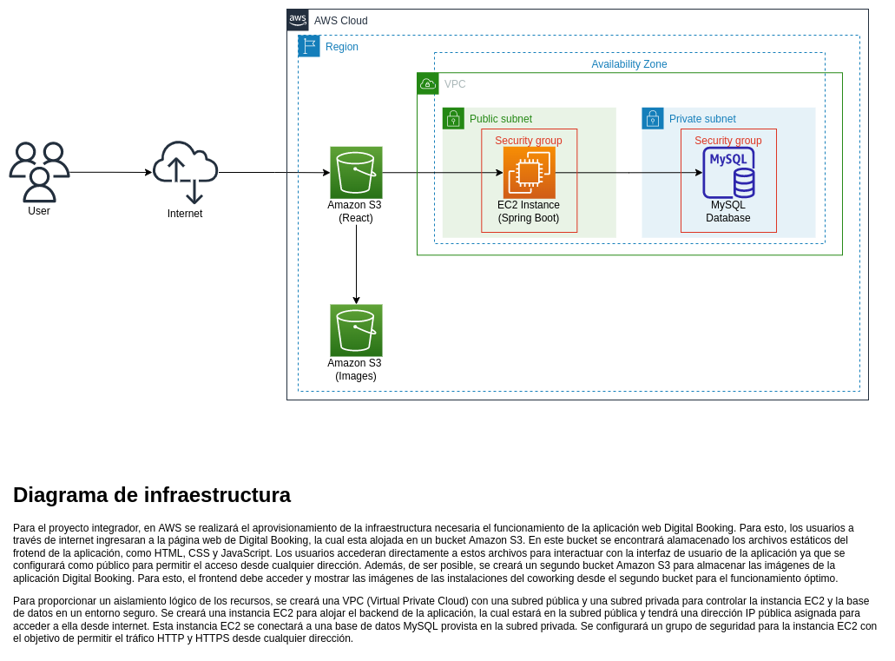
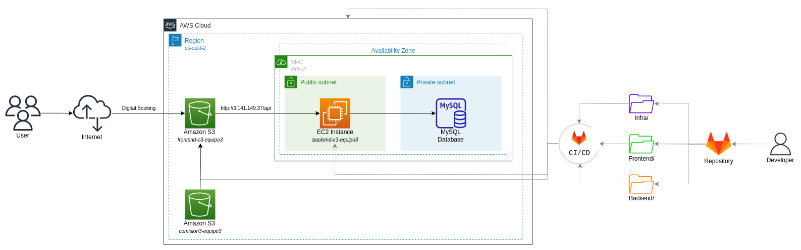
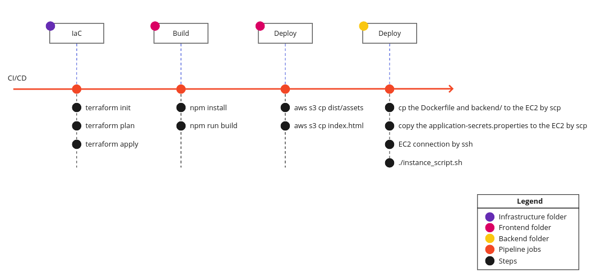

# Infraestructura de la aplicación Digital Booking

Esta carpeta contiene la documentación relacionada con el aprovisionamiento de la infraestructura necesaria para el funcionamiento de la aplicación en AWS. Además, de algunos otros archivos necesarios para explicar la cultura DevOps en el equipo.

## Sprint I

### Manejo del repositorio

Este repositorio es un "monorepo", es decir, contiene todo el código fuente del proyecto Digital Booking. Por lo tanto, se decidió hacer una división física utilizando carpetas para cada una de las áreas del proyecto: frontend, backend, infraestructura y testing.

Se utilizó Gitflow como flujo de trabajo de Git. A partir de la rama *main* , se creó la rama *develop* que representa la rama de desarrollo e integración de las diferentes funcionalidades. Las ramas de funcionalidades o *feature branches* fueron creadas a partir de la rama *develop* y fueron nombradas siguiendo la siguiente nomenclatura: "feature/nombre-de-la-característica". Cada desarrollador debe crear la rama *feature* en la que estará trabajando según la historia de usuario asignada si esta no ha sido creada previamente por otro integrante del equipo.

### Diseño de la infraestructura

Se diseñó la infraestructura que será aprovisionada en la nube de AWS usando diagrams.net y fue complementado con una breve descripción.

Para complementar el diagrama anterior, se agregó la automatización de la infraestructura utilizando Terraform y la utilización de pipelines de CI/CD en Gitlab para actualizar el código de la aplicación de forma automática en la nube. 

## Sprint II

### Aprovisionamiento de la infraestructura con Terraform 

En la raíz del proyecto se creó el archivo de configuración .gitlab-ci.yml para definir y controlar los flujos de trabajo de integración continua y entrega continua (CI/CD, por sus siglas en inglés) en GitLab. Para el manejo de datos sensibles, en la interfaz de usuario del repositorio de GitLab, en la opción CI/CD Settings, en la sección Variables, se crearon las variables de entorno con sus respectivos valores para configurar las credenciales de AWS y los datos de acceso a la base de datos MySQL. Estas variables de entorno fueron guardadas como "*Masked*" para que sean reconocidas en el pipeline. 

En la carpeta "infra", se creó otra carpeta denominada "terraform" para almacenar los archivos de configuración de Terraform. Manualmente, se creó el bucket S3 con el nombre "comision3-equipo3" en la región us-east-2. A este bucket se le habilitó el acceso público y el control de versiones, esto último, con el fin de almacenar el estado de Terraform. Una vez creado este bucket, se editó el archivo .gitlab-ci.yml para correr los comandos de Terraform (*init*, *plan* y *apply*) de forma automatizada en la sección *infra_job*. Por medio de Terraform, se aprovisionó el segundo bucket S3 denominado "frontend-c3-equipo3" con acceso público, la instancia EC2 "backend-c3-equipo3" alojada en la VPC *default* y en la subnet pública de la respectiva VPC. Además, para evitar que la IP pública de la instancia EC2 cambie, se reservó por medio de Terraform una IP elástica "ip-c3-equipo3", la cual fue asiganada a esta instancia

Teniendo en cuenta el aprovisionamiento de la infraestructura, el diagrama de infraestructura del pasado sprint fue modificado con los respectivos nombres de cada recurso.

### CI/CD

En el archivo .gitlab-ci.yml se elaboró un pipeline que consta de los siguientes 4 trabajos o *jobs*:
1. Aprovisionamiento de la infraestructura con Terraform
2. Compilación del proyecto en React (frontend)
3. Despliegue de la aplicación web (frontend) en el bucket S3 en AWS
4. Despliegue del proyecto en Java (backend) en la EC2 en AWS 

Por decisión del equipo, el proyecto en Java correspondiente al backend fue dockerizado. Para esto, en la raíz del proyecto se realizó un archivo Dockerfile con las etapas de *build* y *production*. En el primera etapa se compila y empaqueta la aplicación en un archivo .jar y posteriormente, en la segunda etapa se copia el archivo .jar generado en la etapa anterior y se expone la aplicación en el puerto 8080. Finalmente, se especifica el comando que inicializa la aplicación dentro del contenedor. 

Una vez se copia el archivo Dockerfile y la carpeta backend/ en la instancia EC2, se corre un script de bash que verifica si docker está instalado en la máquina virtual y de ser así, construye la imagen de Docker y ejecuta un contenedor basado en esa imagen.

### Configuración de la EC2 básica 

Aunque en este proyecto la instancia de EC2 (Ubuntu 20.04) no fue configurada de forma manual, si se verificó la instalación de los paquetes necesarios para la aplicación del backend de forma manual. A continuación, se muestran los comandos necesarios para instalar los paquetes de forma manual dado el caso de que la aproximación del despliegue para el backend llegué a ser modificada. 

**Conexión por SSH a la EC2**
* cd path_file_key.pem
* chmod 400 key.pem
* sh -i key.pem -o IdentitiesOnly=yes ubuntu@<IP_insatance>

**Instalación de Java 17**
* sudo apt update
* sudo apt upgrade
* sudo apt install -y openjdk-17-jdk
* java -version

**Instalación de Maven 3.6.3**
* sudo apt update
* wget https://mirrors.estointernet.in/apache/maven/maven-3/3.6.3/binaries/apache-maven-3.6.3-bin.tar.gz
* tar -xvf apache-maven-3.6.3-bin.tar.gz
* sudo mv apache-maven-3.6.3 /opt/
* sudo apt install maven
* mvn -version

**Configuración de las variables de entorno**
* nano ~/.bashrc 

  <! --- Agregar las siguientes líneas en el editor de texto --->

  export JAVA_HOME=/usr/lib/jvm/java-17-openjdk-amd64

  export PATH=$PATH:$JAVA_HOME/bin

  export M2_HOME=/usr/share/maven

  export M2=$M2_HOME/bin

  export PATH=$PATH:$M2
* source ~/.bashrc
* echo $JAVA_HOME
* echo $PATH
* echo $M2_HOME
* echo $M2
