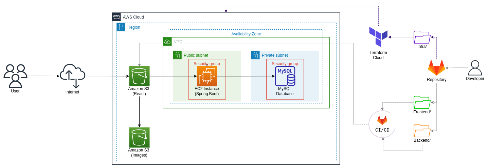

# Infraestructura de la aplicación Digital Booking

Esta carpeta contiene la documentación relacionada con el aprovisionamiento de la infraestructura necesaria para el funcionamiento de la aplicación en AWS. Además, de algunos otros archivos necesarios para explicar la cultura DevOps en el equipo.

## Manejo del repositorio

Este repositorio es un "monorepo", es decir, contiene todo el código fuente del proyecto Digital Booking. Por lo tanto, se decidió hacer una división física utilizando carpetas para cada una de las áreas del proyecto: frontend, backend, infraestructura y testing.

Se utilizó Gitflow como flujo de trabajo de Git. A partir de la rama *main* , se creó la rama *develop* que representa la rama de desarrollo e integración de las diferentes funcionalidades. Las ramas de funcionalidades o *feature branches* fueron creadas a partir de la rama *develop* y fueron nombradas siguiendo la siguiente nomenclatura: "feature/nombre-de-la-característica". Cada desarrollador debe crear la rama *feature* en la que estará trabajando según la historia de usuario asignada si esta no ha sido creada previamente por otro integrante del equipo.

## Diseño de la infraestructura

Se diseñó la infraestructura que será aprovisionada en la nube de AWS usando diagrams.net y fue complementado con una breve descripción.

Para complementar el diagrama anterior, se agregó la automatización de la infraestructura utilizando Terraform y la utilización de pipelines de CI/CD en Gitlab para actualizar el código de la aplicación de forma automática en la nube. 

## Aprovisionamiento de la infraestructura con Terraform 

En la raíz del proyecto se creó el archivo de configuración .gitlab-ci.yml para definir y controlar los flujos de trabajo de integración continua y entrega continua (CI/CD, por sus siglas en inglés) en GitLab. Para el manejo de datos sensibles, en la interfaz de usuario del repositorio de GitLab, en la opción CI/CD Settings, en la sección Variables, se crearon tres variables de entorno con sus respectivos valores para configurar las credenciales de AWS. Estas variables de entorno fueron guardadas como "*Masked*" para que sean reconocidas en el pipeline. 

En la carpeta "infra", se creó otra carpeta denominada "terraform" para almacenar los archivos de configuración de Terraform. Manualmente, se creó el bucket S3 con el nombre "comision3-equipo3" en la región us-east-2. A este bucket se le habilitó el acceso público y el control de versiones, esto último, con el fin de almacenar el estado de Terraform. Una vez creado este bucket, se editó el archivo .gitlab-ci.yml para correr los comandos de Terraform (*init*, *plan* y *apply*) de forma automatizada en la sección *infra_job*. 

tags
team equipo3